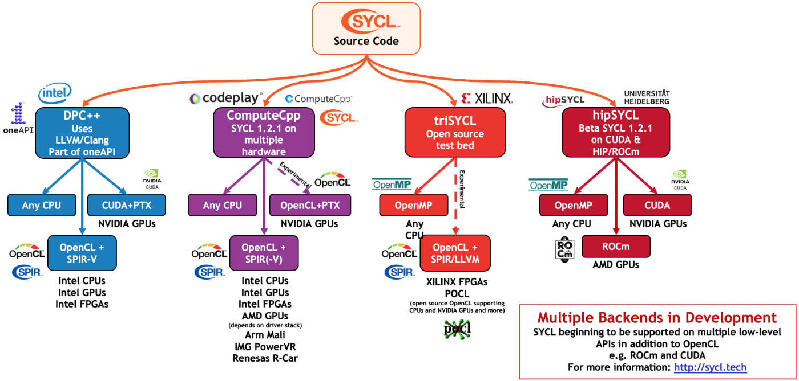

# SYCL

Looks like it is not an
[acronym](https://github.com/KhronosGroup/SYCL-Docs/issues/112), and it is
pronounced "sickle".

## Ecosystem

Status as of [February 1, 2021](https://arrayfire.com/blog/cycling-through-sycl/):

From [`hipSYCL`](https://github.com/illuhad/hipSYCL)

## Implementations

Various implementations, no one really open source and well supported (not as
much as CUDA).

Not all of them have support for all back-ends.
There is also lack of learning material.

Open implementations:

- (dropped) https://github.com/ProGTX/sycl-gtx
- (initially AMD, now Xilinx - unstable) https://github.com/triSYCL/triSYCL
  - docs: http://trisycl.github.io/triSYCL/Doxygen/triSYCL/html/
    - Doxygen generated -> reference, no user manual
- (Heidelberg Uni) hipSYCL https://github.com/illuhad/hipSYCL
  - in principle targets all back-ends via other libraries: CUDA, HIP/ROCm,
    oneAPI
  - it might lack libraries, maybe?

hipSYCL is definitely the best open source one, but still rather incomplete
(triSYCL is only interesting for FPGA).

Proprietary:

- (intel + codeplay) DPC++ https://github.com/intel/llvm/tree/sycl
  - docs: https://intel.github.io/llvm-docs/
  - https://www.oneapi.io/
  - it seems to
- (codeplay) ComputeCpp
  - native support for SYCL BLAS: https://github.com/codeplaysoftware/sycl-blas
  - involved interfaces to:
    - Eigen
    - TensorFlow [through SYCL accelarated Eigen](https://developer.codeplay.com/products/computecpp/ce/guides/tensorflow-overview)
      - turns out TensorFlow already uses Eigen on its own
  - Codeplay is also the original author of SYCL
